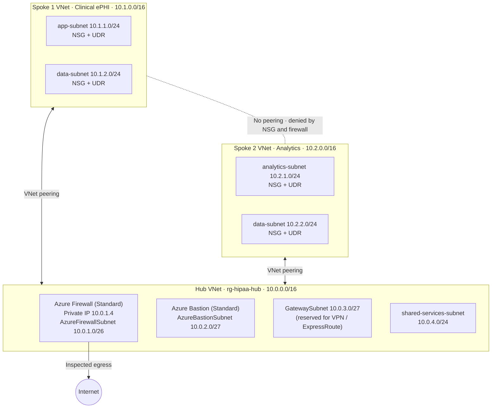
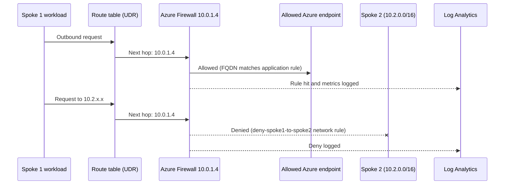
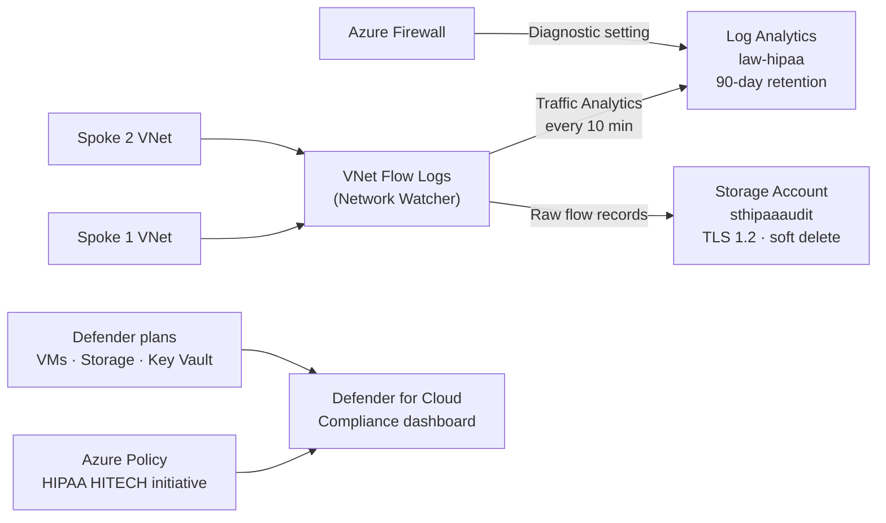

# HIPAA-Compliant Hub and Spoke Network on Azure

HIPAA-compliant Azure hub-and-spoke network built with Terraform: central firewall inspection, isolated clinical and analytics spokes, forced egress routing, Key Vault, 90-day audit logging, and Defender for Cloud compliance monitoring.

**Stack:** Azure Firewall · Virtual Network (VNet) Peering · Network Security Groups (NSGs) · User Defined Routes (UDRs) · Azure Bastion · Key Vault · Log Analytics · VNet Flow Logs · Microsoft Defender for Cloud · Azure Policy · Terraform (azurerm provider 4.x)

| | |
|---|---|
| **Time** | 4–5 hours (deployment alone: 15–20 minutes) |
| **Region** | East US 2 (`eastus2`) |
| **Cost** | Azure Firewall ≈ $1.25/hour, plus hourly Bastion and Defender charges. Destroy when not in use. |
| **Author** | [Fabrizio Mastrogiovanni](https://github.com/fabrizio-mastrogiovanni) |

#Watch me: https://www.loom.com/share/b6c70e5436064c979b776ab66ac6050a

---

## Table of Contents

1. [The Business Problem](#1-the-business-problem)
2. [Architecture](#2-architecture)
3. [HIPAA Technical Safeguards Mapping](#3-hipaa-technical-safeguards-mapping)
4. [What Gets Built](#4-what-gets-built)
5. [Prerequisites](#5-prerequisites)
6. [Step-by-Step Deployment](#6-step-by-step-deployment)
7. [Verification Checklist](#7-verification-checklist)
8. [Troubleshooting](#8-troubleshooting)
9. [Changes From the Original Lab Guide](#9-changes-from-the-original-lab-guide)
10. [Teardown](#10-teardown)
11. [What I Learned](#11-what-i-learned)
12. [What I Would Do Differently](#12-what-i-would-do-differently)

---

## 1. The Business Problem

Healthcare organizations that handle **electronic Protected Health Information (ePHI)** must meet the technical safeguards in the **Health Insurance Portability and Accountability Act (HIPAA)**: access control, audit logging, integrity controls, and encryption in transit and at rest. Violations can bring fines of up to about $1.9 million per violation category per year, plus mandatory public breach disclosure.

Adding security controls to each application individually is slow, inconsistent, and hard to audit. **Hub and spoke** solves this by centralizing the controls:

- **The hub** provides shared security services: firewall inspection, audit logging, secret management, and secure admin access.
- **Each spoke** hosts a workload and inherits those controls automatically.
- **A new application** deployed into a new spoke is protected from day one, without being configured from scratch.

**What this project delivers:**

| Business need | How this project meets it |
|---|---|
| Keep clinical data separate from analytics | Separate VNets and resource groups, with no network path between spokes |
| Prove who accessed what, and when | Centralized logging with 90-day retention |
| Control what leaves the network | All outbound traffic forced through one firewall with allow-listed destinations |
| Remove risky admin access | No public IPs on workloads; admin access only through Bastion |
| Continuous compliance evidence | Defender for Cloud and the HIPAA HITECH policy initiative |
| Repeatable, auditable infrastructure | All resources defined as code (Terraform) |

**Real-world applications:**
- A hospital separating clinical systems (electronic health records, imaging) from reporting workloads
- A health insurer isolating claims processing from fraud analytics
- A pharmaceutical company separating clinical-trial data from business intelligence
- A healthcare SaaS (software as a service) provider giving each customer an isolated spoke on shared security infrastructure

> **Scope note:** This lab implements HIPAA's *technical network* controls. Production HIPAA compliance also requires Business Associate Agreements (BAAs), policies, physical safeguards, and administrative controls.

---

## 2. Architecture

### 2.1 Network Topology

Each spoke peers **only** with the hub. VNet peering is non-transitive, so no direct path exists between Spoke 1 and Spoke 2.



### 2.2 Traffic Flow

Each spoke's route table sends `0.0.0.0/0` to the firewall's private IP. Because the spokes aren't peered with each other, cross-spoke traffic also matches that default route and reaches the firewall, where it's denied.



### 2.3 Logging and Compliance Pipeline



### 2.4 Resource Group Layout

```
rg-hipaa-hub-<yourname>          ← Shared security services
├── vnet-hub                     10.0.0.0/16 (4 subnets)
├── fw-hipaa + pip-firewall      Azure Firewall + public IP
├── fwpol-hipaa                  Firewall policy (rule collections)
├── bastion-hipaa + pip-bastion  Azure Bastion + public IP
├── kv-hipaa                     Key Vault (RBAC, purge protection, public access denied)
├── law-hipaa                    Log Analytics workspace
├── sthipaaaudit                 Audit log storage account
├── nw-hipaa                     Network Watcher
├── flowlog-vnet-spoke1/2        VNet flow logs
└── NWTA-*                       Data collection rule + endpoint (auto-created by Traffic Analytics)

rg-hipaa-spoke1-<yourname>       ← Clinical ePHI
├── vnet-spoke1                  10.1.0.0/16
├── nsg-spoke1-app / -data
└── rt-spoke1                    0.0.0.0/0 → firewall

rg-hipaa-spoke2-<yourname>       ← Analytics (de-identified data)
├── vnet-spoke2                  10.2.0.0/16
├── nsg-spoke2-app / -data
└── rt-spoke2                    0.0.0.0/0 → firewall

Subscription scope
├── Defender for Cloud (Standard): VirtualMachines, StorageAccounts, KeyVaults
└── Policy assignment: HIPAA HITECH
```

---

## 3. HIPAA Technical Safeguards Mapping

HIPAA §164.312 defines the technical safeguards for ePHI. The table maps each one to what this lab **actually deploys**. Items marked *Not implemented* appear in the original lab guide but are not in the code (see [Section 12](#12-what-i-would-do-differently)).

| HIPAA §164.312 requirement | Implemented in this lab | Not implemented |
|---|---|---|
| **Access Control** §164.312(a)(1) | Role-Based Access Control (RBAC) on Key Vault; Bastion for admin access with no public IPs on workloads | — |
| **Audit Controls** §164.312(b) | Central Log Analytics (90-day retention); firewall diagnostic logs; VNet flow logs to storage and Traffic Analytics | Diagnostic settings on every resource |
| **Integrity** §164.312(c)(1) | Key Vault soft delete and purge protection; blob soft delete on the audit storage account | Immutable (WORM) storage policy |
| **Transmission Security** §164.312(e)(1) | TLS 1.2 minimum and HTTPS-only on storage; Key Vault public network access denied | Private endpoints for Key Vault and SQL |
| **Encryption** §164.312(a)(2)(iv) | Azure Storage Service Encryption (platform-managed keys, on by default) | Customer-managed keys (CMK); SQL Transparent Data Encryption (TDE) |
| **Network Segmentation** (addressable) | Hub and spoke; NSGs on every spoke subnet; firewall inspects all egress and cross-spoke traffic | — |
| **Threat Detection** (addressable) | Defender for Cloud (Standard) with the HIPAA HITECH policy initiative | — |

---

## 4. What Gets Built

| Category | Resources |
|---|---|
| Networking | 3 VNets, 8 subnets, 4 peerings, 2 route tables |
| Security | Azure Firewall + policy, 4 NSGs, Bastion, Key Vault |
| Logging | Log Analytics workspace, audit storage account, Network Watcher, 2 VNet flow logs, firewall diagnostic setting |
| Governance | 3 Defender plans, HIPAA HITECH policy assignment |

**Repository structure:**

```
.
├── main.tf                    # All resources
├── variables.tf               # Inputs and address spaces
├── outputs.tf                 # Firewall IPs, VNet IDs, resource group names
├── terraform.tfvars.example   # Copy to terraform.tfvars and fill in
├── .terraform.lock.hcl        # Pinned provider versions (committed on purpose)
├── .gitignore                 # Excludes state files, tfvars, .terraform/
└── README.md
```

---

## 5. Prerequisites

| Requirement | How to verify |
|---|---|
| Azure CLI (command-line interface), signed in | `az account show` |
| Terraform v1.5 or later | `terraform -version` |
| Active Azure subscription | `az account list --output table` |
| **Owner**, or Contributor + User Access Administrator | `az role assignment list --assignee $(az account show --query user.name -o tsv) --output table` |

Owner-level rights are needed because the lab creates role assignments, Defender plans, and a subscription-level policy assignment.

---

## 6. Step-by-Step Deployment

### Step 1: Clone the repository

```bash
git clone https://github.com/fabrizio-mastrogiovanni/HIIPA-Compliant-Hub-Spoke-Network.git
cd HIIPA-Compliant-Hub-Spoke-Network
```

> Avoid spaces and special characters (such as `&`) in folder names. They force you to quote every path and cause `cd` errors.

### Step 2: Sign in and get your subscription ID

```bash
az login
az account show --query id -o tsv
```

Copy the ID that's returned.

### Step 3: Create your variables file

```bash
cp terraform.tfvars.example terraform.tfvars
```

Edit `terraform.tfvars`:

```hcl
yourname        = "yourname"      # lowercase letters and numbers only, max 12 characters
location        = "eastus2"       # must be a valid Azure region name
subscription_id = "00000000-0000-0000-0000-000000000000"
```

**Why these limits?**
- `yourname` becomes part of the storage account name (`sthipaaaudit<yourname>`), which allows only lowercase letters and numbers, 24 characters maximum.
- Key Vault and storage account names must be globally unique.
- `terraform.tfvars` is in `.gitignore`, so your subscription ID never reaches GitHub.

### Step 4: Initialize Terraform

```bash
terraform init
```

**Expected:** `Terraform has been successfully initialized!` The azurerm 4.x provider is downloaded into `.terraform/`.

### Step 5: Format and validate

```bash
terraform fmt
terraform validate
```

**Expected:** `Success! The configuration is valid.`

### Step 6: Review the plan

```bash
terraform plan
```

**Expected:** a summary line with roughly 40 resources to add and no errors. Review what will be created before applying.

### Step 7: Deploy

```bash
terraform apply
```

Type `yes` when prompted.

- Azure Firewall takes **8–12 minutes**; the full deployment takes **15–20 minutes**.
- Billing starts as soon as the firewall exists.
- If `apply` fails partway, fix the error and run `terraform apply` again. Terraform resumes with whatever is still missing.

**Expected:** `Apply complete!` followed by the outputs block.

### Step 8: Review the outputs

```bash
terraform output
terraform output firewall_private_ip
```

**Expected:** `"10.0.1.4"`. Azure assigns the first usable address in `AzureFirewallSubnet` (10.0.1.0/26) to the firewall.

---

## 7. Verification Checklist

### 7.1 Portal checks

| # | Check | Where | Expected result | ✓ |
|---|---|---|---|---|
| 1 | Resource groups | Resource groups | `rg-hipaa-hub`, `rg-hipaa-spoke1`, `rg-hipaa-spoke2` | ☐ |
| 2 | All resources deployed | Resource Manager → All resources | Firewall, policy, Bastion, Key Vault, Log Analytics, 4 NSGs, Network Watcher, 2 flow logs, 2 public IPs | ☐ |
| 3 | Three VNets | Virtual networks | `vnet-hub`, `vnet-spoke1`, `vnet-spoke2` | ☐ |
| 4 | Hub subnets | vnet-hub → Subnets | AzureFirewallSubnet 10.0.1.0/26, AzureBastionSubnet 10.0.2.0/27, GatewaySubnet 10.0.3.0/27, shared-services-subnet 10.0.4.0/24 | ☐ |
| 5 | Spoke address spaces | Each spoke → Overview | Spoke 1: 10.1.0.0/16, 2 subnets. Spoke 2: 10.2.0.0/16, 2 subnets | ☐ |
| 6 | Tags applied | Any resource → Overview | `compliance: hipaa`, `environment: lab`, plus 2 more | ☐ |
| 7 | HIPAA policy assigned | Policy → Assignments | HIPAA HITECH | ☐ |
| 8 | Defender plans | Defender for Cloud → Environment settings | Standard tier on Servers, Storage, Key Vault | ☐ |


> **Note:** On each spoke's **Capabilities** tab, Azure Firewall shows *Not configured*. That's expected: the card refers to a firewall *inside that VNet*. This design deliberately places the firewall in the hub, and the spokes reach it through peering and UDRs.

### 7.2 CLI (command-line) validation

Replace `<yourname>` with your value.

**Route tables point to the firewall**

```bash
terraform output firewall_private_ip

az network route-table show \
  --name rt-spoke1-<yourname> \
  --resource-group rg-hipaa-spoke1-<yourname> \
  --query "routes[].{Name:name, Prefix:addressPrefix, NextHop:nextHopIpAddress}" \
  --output table
```

**Actual result:**

```
"10.0.1.4"
Name                        Prefix     NextHop
--------------------------  ---------  --------
force-internet-via-firewall 0.0.0.0/0  10.0.1.4
```

**Peerings are connected**

```bash
az network vnet peering list \
  --resource-group rg-hipaa-hub-<yourname> \
  --vnet-name vnet-hub-<yourname> \
  --query "[].{Name:name, State:peeringState}" \
  --output table
```

**Actual result:**

```
Name               State
-----------------  ---------
peer-hub-to-spoke2 Connected
peer-hub-to-spoke1 Connected
```

**NSG rules block internet and cross-spoke traffic**

```bash
az network nsg show \
  --name nsg-spoke1-app-<yourname> \
  --resource-group rg-hipaa-spoke1-<yourname> \
  --query "securityRules[].{Name:name, Priority:priority, Access:access, Direction:direction, Source:sourceAddressPrefix}" \
  --output table
```

**Actual result:**

```
Name                   Priority  Access  Direction  Source
---------------------  --------  ------  ---------  -----------
allow-hub-inbound      100       Allow   Inbound    10.0.0.0/16
deny-spoke2-inbound    3000      Deny    Inbound    10.2.0.0/16
deny-internet-inbound  4000      Deny    Inbound    Internet
```

**Key Vault denies public network access**

```bash
az keyvault show \
  --name kv-hipaa-<yourname> \
  --query "properties.networkAcls.defaultAction" \
  --output tsv
```

**Actual result:** `Deny`


### 7.3 Log Analytics validation

In the portal: **Log Analytics workspace → Logs**, then switch the editor from **Simple mode** to **KQL mode**. KQL is Kusto Query Language.

**Firewall metrics (proves the logging pipeline works)**

```kusto
AzureMetrics
| where ResourceId contains "AZUREFIREWALLS"
| summarize count() by MetricName
```

**Actual result:**

| MetricName | count_ |
|---|---|
| NetworkRuleHit | 48 |
| FirewallHealth | 46 |
| SNATPortUtilization | 46 |
| FirewallLatencyPng | 48 |
| ObservedCapacity | 3 |

`count_` is the number of metric records received, not the number of events. To see actual values:

```kusto
AzureMetrics
| where ResourceId contains "AZUREFIREWALLS"
| summarize Total = sum(Total), Avg = avg(Average) by MetricName
```


**Firewall logs**

```kusto
AzureDiagnostics
| where ResourceType == "AZUREFIREWALLS"
| where TimeGenerated > ago(24h)
| take 50
```

**Actual result:** *No results found.* This is expected. No virtual machines (VMs) are deployed in the spokes, so no traffic has passed through the firewall. See [Troubleshooting #12](#8-troubleshooting).

---

## 8. Troubleshooting

Every error below occurred during this build.

| # | Error | Cause | Fix |
|---|---|---|---|
| 1 | `cd: The directory ... does not exist` / `cd: expected 1 arguments; got 4` | Wrong working directory, and a path containing spaces and `&` was not quoted | Quote the full path: `cd "/Users/.../Cloud Engineering Labs/<folder>"`. Confirm with `pwd` before running Terraform. Commands on following lines still run after a failed `cd`, so check where stray files landed. |
| 2 | `Invalid single-argument block definition` | Copy-pasting from the lab document collapsed multi-argument `variable` blocks onto one line | Put each argument on its own line. Run `terraform fmt`. |
| 3 | `Reference to undeclared input variable` (`yourname`, `location`, `tags`) | Those `variable` blocks were missing from `variables.tf` | Restore the full `variables.tf`. |
| 4 | Invalid location | `eastus1` is not an Azure region name | Use `eastus2` (list valid names: `az account list-locations -o table`). |
| 5 | `Argument is deprecated: disable_bgp_route_propagation` | Argument renamed in newer provider versions, with **inverted logic** | Use `bgp_route_propagation_enabled = false`. Setting it to `true` would let gateway routes bypass the firewall. |
| 6 | `GatewayAllocationFailed: Compute allocation failed` (Azure Firewall) | Temporary lack of Azure capacity in the region | Wait a few minutes and re-run `terraform apply`. |
| 7 | `409 Conflict: Another update operation is in progress` (Defender pricing) | Three Defender plans updated the same subscription setting in parallel | Chain them with `depends_on` so they apply one at a time. |
| 8 | `NsgFlowLogCreationBlocked` | Azure blocked creation of new NSG flow logs on June 30, 2025 (full retirement September 30, 2027) | Replace with **VNet flow logs** (`target_resource_id` = VNet ID). One log per VNet covers every subnet. |
| 9 | `Unsupported argument: target_resource_id` / `Missing required argument: network_security_group_id` | VNet flow logs need azurerm provider **4.x**; the lab guide pinned **3.x** | Set `version = "~> 4.0"`, add `subscription_id` to the provider block, then run `terraform init -upgrade`. |
| 10 | `A resource with the ID ... already exists - to be managed via Terraform this resource needs to be imported` | The failed firewall deployment (#6) created the resource in Azure but never recorded it in Terraform state | Check `provisioningState`. If `Succeeded`: `terraform import azurerm_firewall.hub "<resource-id>"`. If `Failed`: delete it with `az resource delete --ids "<resource-id>"`, then re-apply. |
| 11 | *(Silent, no error)* Firewall rules not enforced | The lab guide creates a firewall policy but never attaches it to the firewall | Add `firewall_policy_id = azurerm_firewall_policy.hub.id` to `azurerm_firewall`. |
| 12 | `'project' operator: Failed to resolve scalar expression named 'msg_s'` | Log Analytics creates columns only when the first matching log arrives; no traffic means no firewall logs and no columns | Query without naming columns (`take 50`), or use `AzureMetrics` to confirm the pipeline. Deploy a test VM to generate logs. |
| 13 | `Argument is deprecated: enable_rbac_authorization` | Renamed in azurerm 4.x | Use `rbac_authorization_enabled = true`. |
| 14 | Key Vault name conflict on redeploy | Soft delete keeps the vault name reserved for 90 days. With **purge protection** enabled, `az keyvault purge` is blocked until retention expires. | The provider setting `recover_soft_deleted_key_vaults = true` recovers the vault automatically on redeploy. Otherwise, use a different `yourname`. |

---

## 9. Changes From the Original Lab Guide

| Change | Why |
|---|---|
| Provider `~> 3.0` → `~> 4.0`, plus `subscription_id` in the provider block | Required for VNet flow logs; 4.x requires an explicit subscription ID |
| NSG flow logs (3) → VNet flow logs (2) | NSG flow log creation is blocked by Azure; VNet flow logs also cover Spoke 2's data subnet, which the original skipped |
| Added `firewall_policy_id` to the firewall | Without it, none of the allow or deny rules apply |
| `depends_on` chain on Defender plans | Prevents 409 conflicts |
| `disable_bgp_route_propagation = true` → `bgp_route_propagation_enabled = false` | Deprecated argument (inverted logic) |
| `enable_rbac_authorization` → `rbac_authorization_enabled` | Deprecated argument |
| `subscription_id` variable added | Keeps the subscription ID in the git-ignored `terraform.tfvars` |
| `.terraform.lock.hcl` removed from `.gitignore` | HashiCorp recommends committing it so everyone uses the same provider versions |

Key snippets:

```hcl
# Firewall — attach the policy
resource "azurerm_firewall" "hub" {
  # ...
  sku_tier           = "Standard"
  firewall_policy_id = azurerm_firewall_policy.hub.id
}

# VNet flow log (replaces NSG flow logs)
resource "azurerm_network_watcher_flow_log" "spoke1_vnet" {
  name                 = "flowlog-vnet-spoke1"
  network_watcher_name = azurerm_network_watcher.main.name
  resource_group_name  = azurerm_resource_group.hub.name
  target_resource_id   = azurerm_virtual_network.spoke1.id
  storage_account_id   = azurerm_storage_account.audit.id
  enabled              = true
  version              = 2
  # retention_policy and traffic_analytics blocks — see main.tf
}

# Defender plans — apply sequentially
resource "azurerm_security_center_subscription_pricing" "defender_storage" {
  tier          = "Standard"
  resource_type = "StorageAccounts"
  depends_on    = [azurerm_security_center_subscription_pricing.defender_servers]
}
```

---

## 10. Teardown

Azure Firewall bills about **$1.25/hour (about $30/day)** whether or not traffic flows. Destroy it as soon as you're done.

```bash
terraform destroy
```

Type `yes` to confirm. This removes all three resource groups and everything inside them.

**After destroy, verify:**

```bash
az group list --query "[?contains(name, 'hipaa')].name" -o table
```

**Expected:** no results.

Also check these subscription-level items in the portal:
- **Defender for Cloud → Environment settings:** confirm the Servers, Storage, and Key Vault plans are back on the tier you want, since Defender bills per protected resource.
- **Key Vault → Manage deleted vaults:** the vault remains in soft-delete for 90 days (see [Troubleshooting #14](#8-troubleshooting)).

---

## 11. What I Learned

- **Peering doesn't route traffic through the firewall; UDRs do.** Peering only connects networks. Without the `0.0.0.0/0 → firewall` route, spoke traffic bypasses inspection entirely.
- **Peering is non-transitive**, and that's what isolates the spokes. Spoke-to-spoke traffic has no direct path, so it follows the default route to the firewall and gets denied there.
- **Defense in depth works.** Cross-spoke traffic is blocked twice, by NSG rules and by firewall network rules, so one misconfiguration doesn't expose ePHI.
- **"Apply complete" doesn't mean "secure."** The lab guide's firewall policy was never attached. The deployment succeeded while enforcing nothing. Verification matters more than a green checkmark.
- **Cloud platforms change under your code.** NSG flow log retirement, renamed arguments, and provider version changes all broke a published lab guide. Read errors carefully and check provider documentation.
- **Terraform state is its inventory.** A failed apply can leave orphaned resources that exist in Azure but not in state. The fix is always `import` (keep it) or delete (rebuild it).
- **Some errors are the platform, not your code.** `GatewayAllocationFailed` was an Azure capacity issue, fixed by a retry.
- **Subscription-level settings serialize.** Parallel updates to Defender plans conflict, and `depends_on` enforces ordering.
- **Log Analytics schemas are created on first data.** A KQL error about a missing column can simply mean no data has arrived yet. `AzureMetrics` proved the pipeline worked before any traffic existed.
- **Git hygiene protects secrets.** State files and `terraform.tfvars` can contain sensitive values; they stay out of the repository.

---

## 12. What I Would Do Differently

**Closing the compliance gaps**
- Add **private endpoints** for Key Vault and the audit storage account, with Private DNS zones linked to the hub.
- Implement **customer-managed keys** in Key Vault for storage encryption.
- Add an **immutable (WORM) retention policy** to the audit log container, and disable shared-key access and public blob access on the storage account.
- Add **diagnostic settings** for Key Vault, NSGs, Bastion, and the storage account, not just the firewall.
- Extend log retention to **365 days or more** for production.
- Grant the policy assignment's managed identity the roles it needs for **remediation tasks**.

**Engineering practices**
- Use a **remote state backend** (Azure Storage with state locking) instead of local state.
- Refactor spokes into a **reusable module** with `for_each`, so adding a spoke is one map entry.
- Validate `yourname` with a Terraform `validation` block to catch naming errors before `apply`.
- Add a **CI pipeline** (GitHub Actions) that runs `fmt`, `validate`, `tflint`, and a security scanner such as Checkov on every push.
- Write code in the editor or pull it from the repo instead of copy-pasting from formatted documents, which caused two errors.

**Architecture**
- Deploy a small **test VM** in each spoke to generate real traffic and prove the deny rules with logs.
- Enable **DNS proxy** on the firewall and point the spokes' DNS at it, so FQDN-based network rules resolve consistently.
- Evaluate **Azure Firewall Premium** for TLS inspection and intrusion detection (IDPS) in regulated environments.
- Add **Azure DDoS Protection** on the hub and a VPN or ExpressRoute gateway in `GatewaySubnet` for hybrid connectivity.
- At larger scale (dozens of spokes or multiple regions), consider **Azure Virtual WAN** as a managed hub.
- Use **Bastion Basic** in labs to cut cost, reserving Standard for production features.
